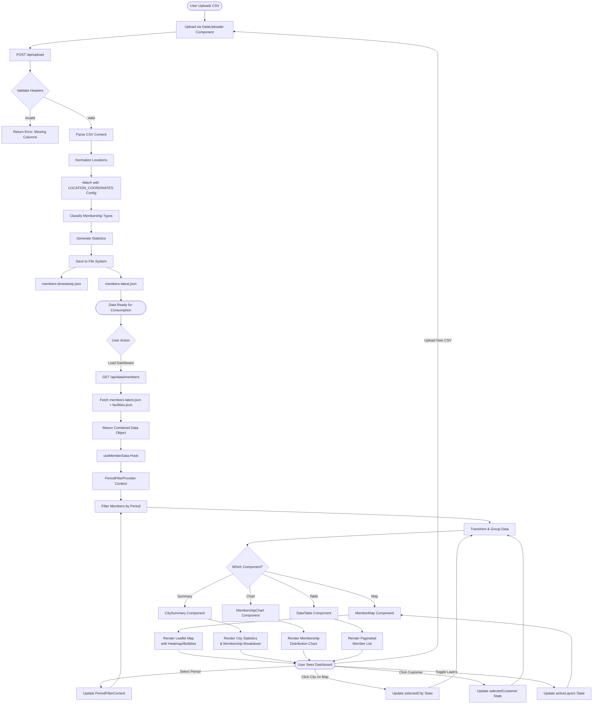
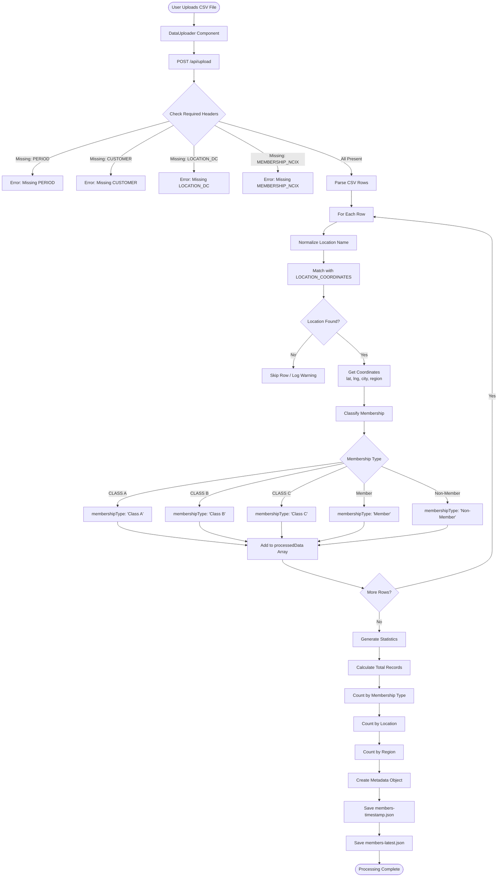
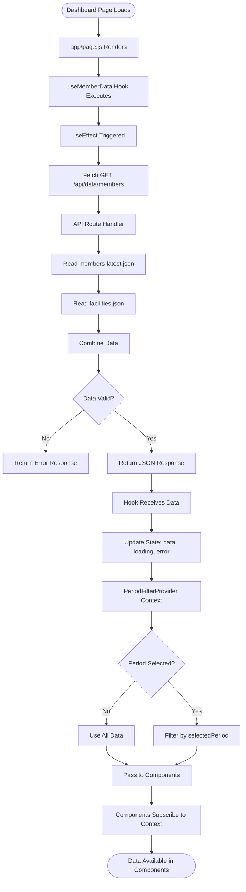
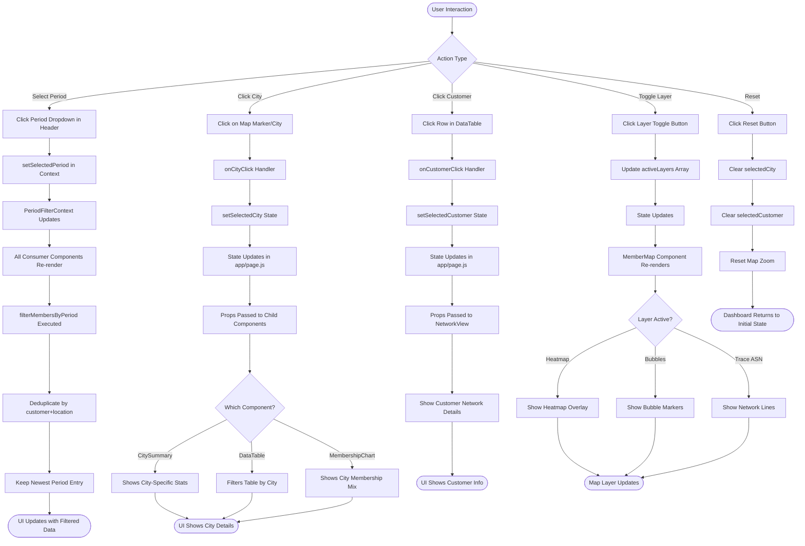
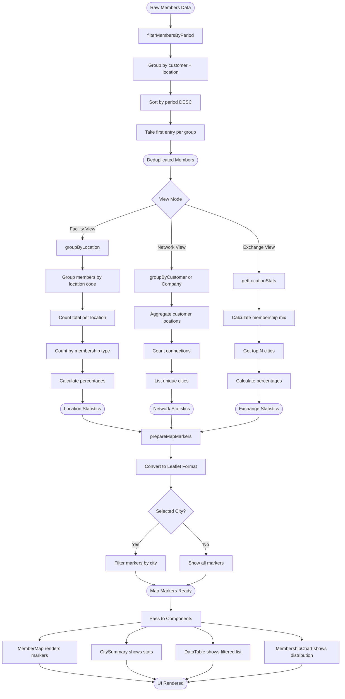
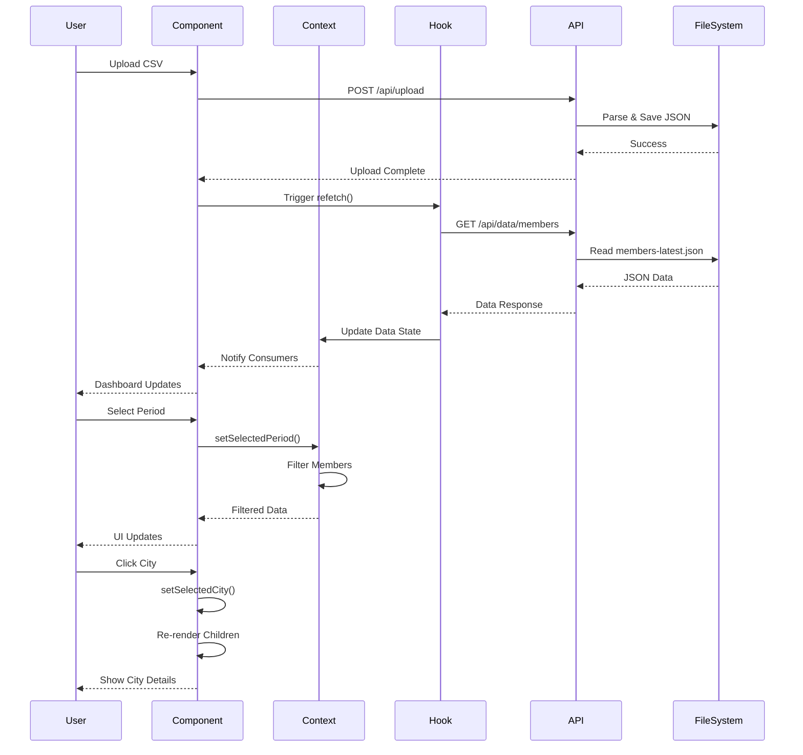

# Flowchart Proses Data - NCIX Reporting Dashboard

Dokumen ini menjelaskan alur proses data dalam aplikasi NCIX Reporting Dashboard, dari upload data CSV hingga visualisasi di UI.

## 📊 Overview Arsitektur

Aplikasi ini menggunakan arsitektur **Next.js dengan Client-Side State Management** dan **Server-Side API**. Data mengalir melalui beberapa tahap:

1. **Data Ingestion** (Upload CSV)
2. **Data Processing** (Validasi & Transformasi)
3. **Data Storage** (File System JSON)
4. **Data Retrieval** (API Endpoints)
5. **State Management** (React Context & Hooks)
6. **UI Rendering** (Components)

---

## 🔄 Flowchart Utama - Complete Data Flow



---

## 📥 Flowchart Detail 1: Data Ingestion & Processing



---

## 🔍 Flowchart Detail 2: Data Retrieval & Loading



---

## 🎯 Flowchart Detail 3: State Management & User Interactions



---

## 🧮 Flowchart Detail 4: Data Transformation & Filtering



---

## 🗂️ Data Structure Flow

### Input (CSV Format)
```
PERIOD, CUSTOMER, LOCATION_DC, MEMBERSHIP_NCIX
202401, PT ABC, JAKARTA, Class A
202401, PT XYZ, SURABAYA, Member
```

### After Processing (JSON)
```json
{
  "metadata": {
    "processedAt": "2024-01-15T10:30:00Z",
    "sourceFile": "members.csv",
    "totalRecords": 150,
    "statistics": {
      "byMembershipType": { "Class A": 50, "Class B": 30, ... },
      "byLocation": { "JAKARTA": 70, "SURABAYA": 40, ... },
      "byRegion": { "Jabodetabek": 100, "Jawa": 30, ... }
    }
  },
  "locations": [
    { "name": "JAKARTA", "lat": -6.2088, "lng": 106.8456, "city": "Jakarta", "region": "Jabodetabek" }
  ],
  "members": [
    {
      "period": "202401",
      "customer": "PT ABC",
      "location": "JAKARTA",
      "locationDisplay": "Jakarta",
      "region": "Jabodetabek",
      "latitude": -6.2088,
      "longitude": 106.8456,
      "membershipType": "Class A"
    }
  ]
}
```

### After Context Filter (React State)
```javascript
{
  members: [...], // filtered by selectedPeriod
  selectedCity: { city: "Jakarta", region: "Jabodetabek", ... },
  selectedCustomer: { customer: "PT ABC", ... },
  activeLayers: ["heatmap", "bubbles"],
  viewMode: "facility"
}
```

---

## 🔑 Key Components & Responsibilities

| Component | Input | Processing | Output |
|-----------|-------|------------|--------|
| **DataUploader** | CSV file | Upload to API | Success/Error message |
| **API /upload** | CSV content | Validate, parse, normalize, classify | Saved JSON files |
| **API /data/members** | - | Read JSON files | Combined data object |
| **useMemberData** | API endpoint | Fetch & cache | { data, loading, error } |
| **PeriodFilterProvider** | Selected period | Filter members | Filtered data to consumers |
| **MemberMap** | Members, layers | Group by location, render map | Map visualization |
| **CitySummary** | Selected city, members | Calculate stats | Statistics display |
| **DataTable** | Members, filters | Paginate & filter | Table rows |
| **MembershipChart** | Members | Aggregate by type | Chart visualization |

---

## 🎨 View Modes & Data Display

### Facility View
1. **Data Source**: All members filtered by period & city
2. **Processing**: Group by location → Count by membership type
3. **Display**:
   - Map: Heatmap/bubbles by member count
   - Summary: Total members, breakdown by Class A/B/C
   - Chart: Membership distribution pie/bar chart
   - Table: List of all members with pagination

### Network View
1. **Data Source**: Members filtered by customer & city
2. **Processing**: Group by customer/company → Count connections
3. **Display**:
   - Map: Network trace lines between cities
   - Summary: Company info, connection count, unique cities
   - Chart: Top companies by member count or locations
   - Table: Clickable customer rows for detail view

### Exchange View
1. **Data Source**: All members across Indonesia
2. **Processing**: Aggregate statistics nationwide
3. **Display**:
   - Map: Overall distribution heatmap
   - Summary: Total members, membership mix in percentages
   - Chart: Top cities by member count
   - Table: Summary statistics (read-only)

---

## 🔄 Real-time Update Flow



---

## 📊 Performance Considerations

1. **Data Caching**: `useMemberData` caches API response until manual refetch
2. **Deduplication**: `filterMembersByPeriod` removes duplicate entries
3. **Lazy Loading**: Components only process data when rendered
4. **Pagination**: DataTable limits to 15 items per page
5. **Memoization**: Map markers only recalculate on data/filter changes

---

## 🔐 Data Validation Rules

### CSV Upload Validation
- ✅ Required columns: PERIOD, CUSTOMER, LOCATION_DC, MEMBERSHIP_NCIX
- ✅ Period format: YYYYMM (e.g., 202401)
- ✅ Location must match LOCATION_COORDINATES config
- ✅ Membership type must be valid classification

### Location Normalization
```javascript
Input: "jakarta", "JAKARTA", "Jakarta DC"
↓
Normalized: "JAKARTA"
↓
Matched: { name: "JAKARTA", lat: -6.2088, lng: 106.8456 }
```

### Membership Classification
```javascript
Input: "CLASS A NCIX", "Class A", "NCIX CLASS-A"
↓
Classified: "Class A"

Input: "Member NCIX", "member"
↓
Classified: "Member"

Input: "Non Member", "Non-member"
↓
Classified: "Non-Member"
```

---

## 📝 Summary

Aplikasi NCIX Reporting Dashboard mengimplementasikan alur data yang terstruktur:

1. **Upload** → CSV diunggah oleh user
2. **Process** → API memvalidasi, menormalisasi, dan menyimpan sebagai JSON
3. **Retrieve** → React hooks mengambil data via API
4. **Filter** → Context menyaring berdasarkan period
5. **Transform** → Utils mengelompokkan dan mengagregasi data
6. **Render** → Components menampilkan visualisasi interaktif

Setiap interaksi user memicu update state yang cascading melalui component tree, memastikan UI selalu sinkron dengan data terbaru.
